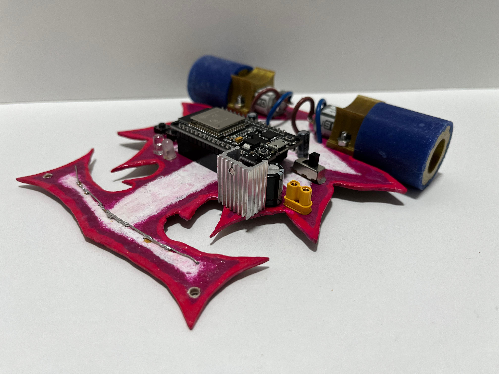
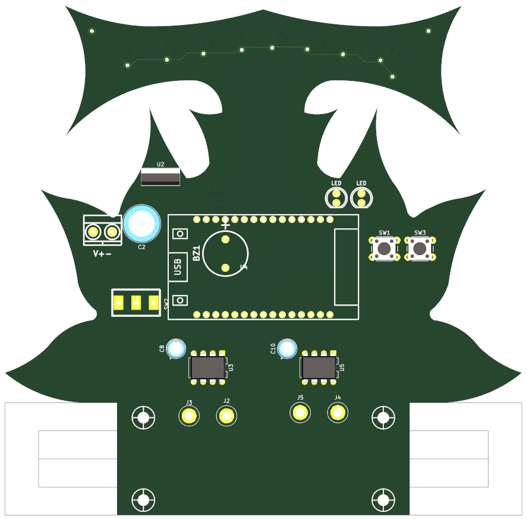

# 🌸 LineFollower Loto

**Loto** es un robot velocista diseñado para competir en la disciplina de **seguidor de línea** (fondo negro con línea blanca) organizada por la **LNR**. Su diseño está inspirado en los pétalos de una flor.

  

  
  

---

## 🚀 Características principales

| Especificación | Detalle |
|----------------|---------|
| **Dimensiones** | 138 mm (ancho) x 157 mm (largo) |
| **Chasis** | PCB estructural + soporte de motores impreso en PLA |
| **Batería** | LiPo 3S 350 mAh |
| **Microcontrolador** | ESP32 |
| **Sensores** | 8 sensores QRE (QRE1113GR) |
| **Motores** | ProFast 12V 3600 RPM |
| **Driver de motores** | TA6586 |

---

## ⚡ Entradas / Salidas (I/O)

### Entradas (sensores y botones)
| Pin ESP32 | Descripción |
|-----------|-------------|
| GPIO13 | QRE sensor 1 |
| GPIO27 | QRE sensor 2 |
| GPIO26 | QRE sensor 3 |
| GPIO25 | QRE sensor 4 |
| GPIO33 | QRE sensor 5 |
| GPIO32 | QRE sensor 6 |
| GPIO35 | QRE sensor 7 |
| GPIO34 | QRE sensor 8 |
| GPIO17 | Pulsador 1 |
| GPIO16 | Pulsador 2 |

### Salidas (motores y otros)
| Pin ESP32 | Descripción |
|-----------|-------------|
| GPIO19 | PWM A Motor 1 |
| GPIO21 | PWM B Motor 1 |
| GPIO22 | PWM A Motor 2 |
| GPIO23 | PWM B Motor 2 |
| GPIO04 | LED 1 |
| GPIO05 | LED 2 |
| GPIO18 | BUZZER |

---

## 🛠 Tecnologías utilizadas

- **FreeCAD** → Diseño mecánico del soporte de motores y elementos impresos
- **KiCad** → Diseño del PCB
- **PlatformIO VisualStudioCODE** → Firmware para el ESP32

---

## 📂 Archivos

- `1_hardware_pcb/` → Archivos de KiCad (PCB + esquemas)  
- `2_hardware_3d/` → Archivos FreeCAD / STL de las piezas impresas
- `3_firmware/` → Código fuente para el ESP32
- `4_assets/` → Fotos y videos del robot  
- `docs/` → Diagramas, esquemas y documentación

---
